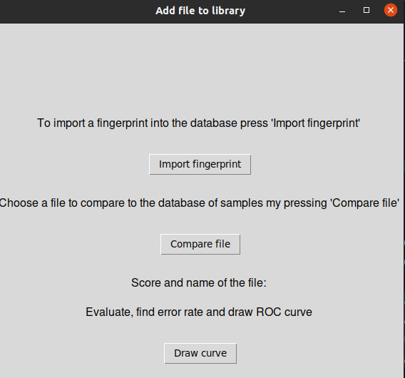

# Learning tkinter  

Throughout my 4 years of computer science I have never actually made a UI with python so that was about to be a new experience. I was kind of scared of the amout I had to learn just to make one of the tasks work, but it ended up going pretty well and not being to difficult. 

It was really easy to start with and as I did not need any fancy really good looking UI, it was good enough. I quickly made a couple of buttons my following the simplest tutorials I found on the internet. 

```python

instructions1 = tk.Label(root, text="To import a fingerprint into the database press 'Import fingerprint' ", font=("Helvetica", 12))
instructions1.pack(pady=10)
select_button = tk.Button(root, text="Import fingerprint", command=lambda: select_file(return_on_adding_fingerprint=return_on_adding_fingerprint,root= root))
select_button.pack(pady=20)

```
Those lines were actually enough ( with some small additions here and there ), to make the UI run and have the actual button displayed. As showed in the code snipped, it is really easy to connect functions to it as well and the internet is full of different guides and tutorials that helps with app delvelopment. I present my UI to you here, it's ugly but it's does the job. I promise I have an actual sense of beauty, this is a product of me breaking my leg a week before deadline and stressing with getting everything done. 

<div style="text-align:center">
        
</div>

